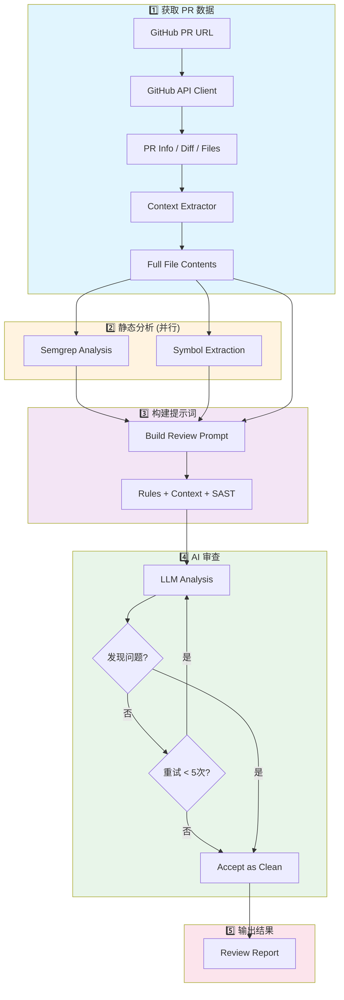
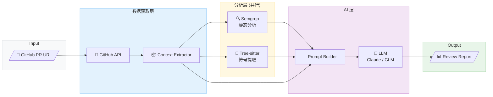
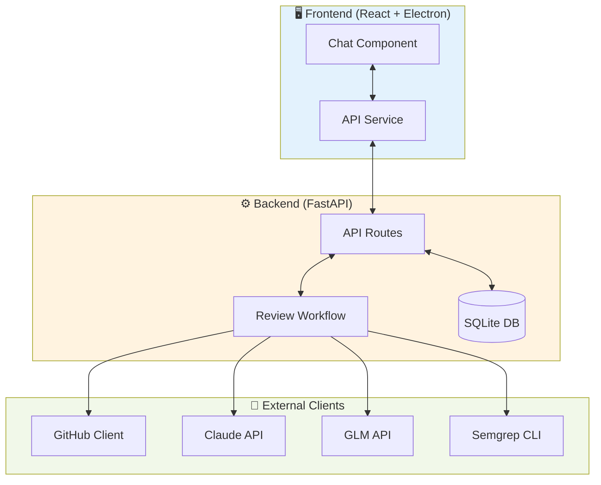

<div align="center">
  <h1>DiffCOT - AI 代码审查系统</h1>
  <p>基于LLM的智能代码审查工具</p>
  
</div>

---

DiffCOT 是一个基于LLM的智能代码审查系统，支持对 GitHub Pull Request 进行自动化代码审查，结合静态分析工具 Semgrep 和 通用大模型分析能力，发现代码中的潜在问题。

## 功能特点

- 🔍 **智能代码审查**: 利用 Claude/GLM 等大语言模型进行深度代码分析
- 🛡️ **静态分析集成**: 集成 Semgrep 进行 SAST (静态应用安全测试)
- 📊 **多窗口并行分析**: 支持同时对多个 PR 进行审查
- 💾 **会话持久化**: SQLite 数据库存储审查历史和对话记录
- 🎯 **自定义规则库**: 支持自定义 Semgrep 规则和 LLM 提示词规则
- 🌐 **跨文件分析**: 自动提取相关上下文进行关联分析

## 安装与使用

### 环境要求

- Python 3.12+
- Node.js 18+
- Semgrep CLI (可选，用于静态分析)

`Python`用于构建项目的后端程序，`Node.js`用于构建项目前端。`Semgrep CLI`安装可按照如下命令执行。

```bash
# For macOS
$ brew install semgrep

# For Ubuntu/WSL/Linux/macOS
$ python3 -m pip install semgrep
```

### 后端运行

```bash
cd backend

# 创建虚拟环境(conda)
conda create -n your_env_name python=3.12
conda activate your_env_name

# 安装依赖
pip install -r requirements.txt

# 启动后端服务
python main.py
# 或使用 uvicorn
python -m uvicorn main:app --host 127.0.0.1 --port 8765 --reload
```

### 前端运行

```bash
# 另起一个终端
cd frontend

# 安装依赖
npm install

# 开发模式运行
npm run dev:electron
```
### 配置说明

1. **GitHub Token**: 在设置页面配置 GitHub Personal Access Token
2. **AI Provider**: 支持 Claude (Anthropic) 和 GLM (智谱)
3. **API Keys**: 在设置页面配置相应的 API Key

### 使用流程
#### 基础 Code Review 流程
第 1 步：启动后端服务
第 2 步：启动前端应用 或者直接运行安装好的应用程序。
第 3 步：点击 New Repo，打开对话窗口。
<div align="center">
  
</div>
第 4 步：在设置页面配置 GitHub Token 和 相关大模型厂商的API Key
<div align="center">
  
</div>
第 5 步：在主界面输入 GitHub 仓库 URL，点击 Add 后自动爬取 Pull Request 数据。
<div align="center">
  
</div>
第 6 步：选择要审查的 Pull Request，并点击 "Start Analysis" 开始审查
<div align="center">
  
</div>
第 7 步：等待 AI 分析完成，查看审查报告
<div align="center">
  
</div>
第 8 步：分析完成后窗口会弹出 "Comment on GitHub" 的按钮，点击该按钮，审查报告自动提交至远程仓库对应的PR当中。


#### Semgrep 自定义规则库添加
第 1 步：点击应用左下角的 Semgrep Rules，进入自定义规则库管理页面。
<div align="center">
  
</div>
第 2 步：根据自己的开发审查需求添加或者删除规则，并支持点击`Validate`验证规则是否正确和基于id搜索规则的功能。
<div align="center">
  
</div>

具体的 Semgrep Rules 规范可见[Writing Semgrep rules](https://semgrep.dev/docs/writing-rules/overview)

## 目录结构

### 前端 (`frontend/`)

```
frontend/
├── electron/                    # Electron 桌面应用配置
│   ├── main.ts                 # Electron 主进程
│   └── preload.ts              # 预加载脚本
├── src/
│   ├── components/             # React 组件
│   │   ├── Chat.tsx           # 主聊天/审查界面组件
│   │   ├── Sidebar.tsx        # 侧边栏导航组件
│   │   ├── Settings.tsx       # 设置页面组件
│   │   ├── SemgrepRules.tsx   # Semgrep 规则管理组件
│   │   └── Welcome.tsx        # 欢迎页面组件
│   ├── services/
│   │   └── api.ts             # 后端 API 调用封装
│   ├── App.tsx                # 应用主入口组件
│   ├── main.tsx               # React 应用入口
│   ├── types.ts               # TypeScript 类型定义
│   └── index.css              # 全局样式
├── package.json               # 依赖配置
└── vite.config.ts             # Vite 构建配置
```

### 后端 (`backend/`)

```

backend/
├── api/                       # FastAPI 路由和模型
│   ├── routes/
│   │   ├── review.py          # 代码审查 API 端点
│   │   ├── conversations.py   # 会话管理 API
│   │   ├── github.py          # GitHub API 代理
│   │   ├── settings.py        # 设置 API
│   │   └── semgrep_rules.py   # Semgrep 规则管理 API
│   ├── models/
│   │   └── schemas.py         # Pydantic 数据模型
│   ├── database.py            # SQLite 数据库操作
│   └── config_manager.py      # 配置管理器
├── client/                    # 外部服务客户端
│   ├── github_client.py       # GitHub API 客户端
│   ├── claude_api_client.py   # Claude API 客户端
│   ├── glm_api_client.py      # GLM (智谱) API 客户端
│   ├── semgrep_client.py      # Semgrep 静态分析客户端
│   ├── context_extractor.py   # 代码上下文提取器
│   └── symbol_extractor.py    # 代码符号提取器 (Tree-sitter)
├── review_engine/
│   └── review_workflow.py     # LangGraph 审查工作流
├── configs/
│   ├── review_rules.py        # LLM 审查规则提示词
│   ├── pr_size_limits.py      # PR 大小限制配置
│   ├── constants.py           # 常量定义
│   └── semgrep_rules/
│       └── custom_rules.yaml  # 自定义 Semgrep 规则
├── utils/
│   ├── logger.py              # 日志工具
│   ├── json_parser.py         # JSON 解析工具
│   └── paths.py     	       # 运行路径管理文件
├── data/                      # 数据存储目录
│   └── conversations.db       # SQLite 数据库文件
├── main.py                    # FastAPI 应用入口
└── requirements.txt           # Python 依赖
```

## Code Review 工作流程

DiffCOT 采用 LangGraph 构建的状态机工作流，完整流程如下：



### 数据流架构



### 核心模块交互



## 自定义规则

### Semgrep 规则

在 `backend/configs/semgrep_rules/custom_rules.yaml` 中添加自定义规则：

```yaml
rules:
  - id: my-custom-rule
    languages: [python]
    severity: ERROR
    message: "描述发现的问题"
    pattern: "危险的代码模式"
```

### LLM 审查规则

在 `backend/configs/review_rules.py` 中添加审查提示词规则，包括：

- `HARD_EXCLUSION_RULES`: 需要排除的误报模式
- `STATIC_DEFECT_RULES`: 静态代码缺陷检测规则
- `LOGIC_DEFECT_RULES`: 逻辑缺陷检测规则
- `STYLE_ENCAPSULATION_RULES`: 代码风格和封装规则

## 技术栈

### 前端

- React 18 + TypeScript
- Vite 构建工具
- Electron
- TailwindCSS 样式

### 后端

- FastAPI Web 框架
- LangGraph 工作流引擎
- SQLite 数据存储
- Semgrep 静态分析
- Tree-sitter 代码解析

### 大模型

- Anthropic Claude (claude-opus-4-5-20251101)
- 智谱 GLM (glm-4.6)

## 许可证

本项目采用 [MIT 许可证](LICENSE) 开源。

## 贡献

欢迎提交 Issue 和 Pull Request！

## 致谢

- [Semgrep](https://semgrep.dev/) - 静态代码分析
- [LangGraph](https://github.com/langchain-ai/langgraph) - Workflow编排
- [Tree-sitter](https://tree-sitter.github.io/) - 代码解析
